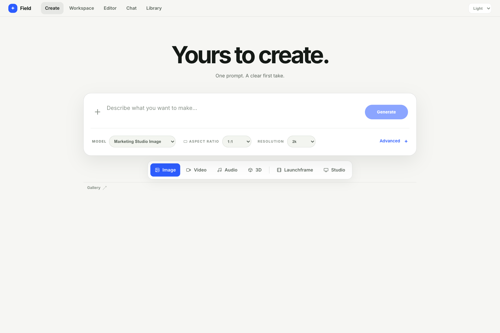
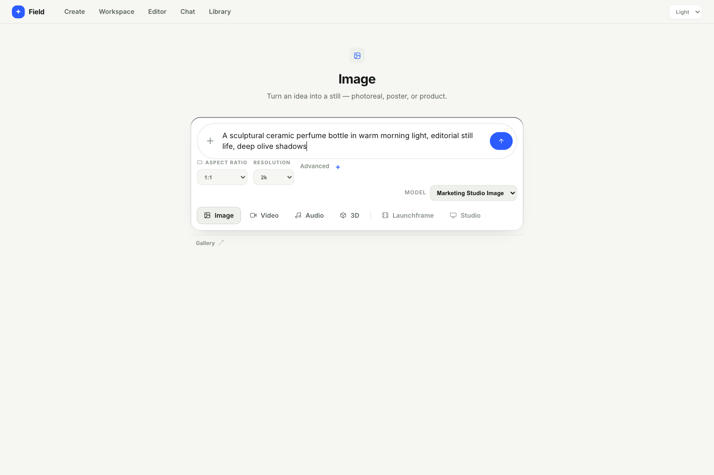
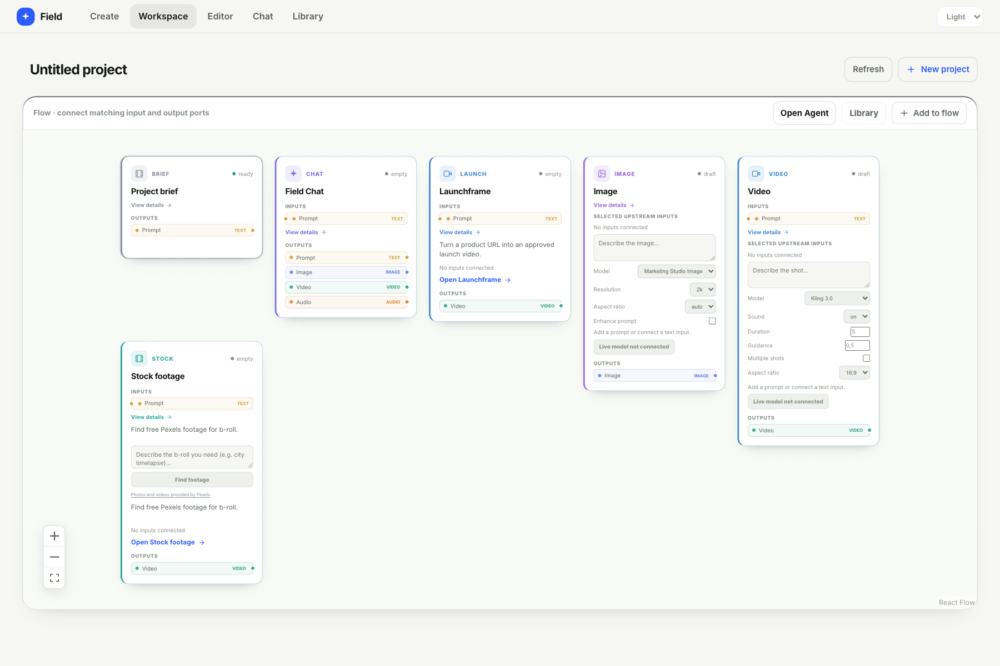
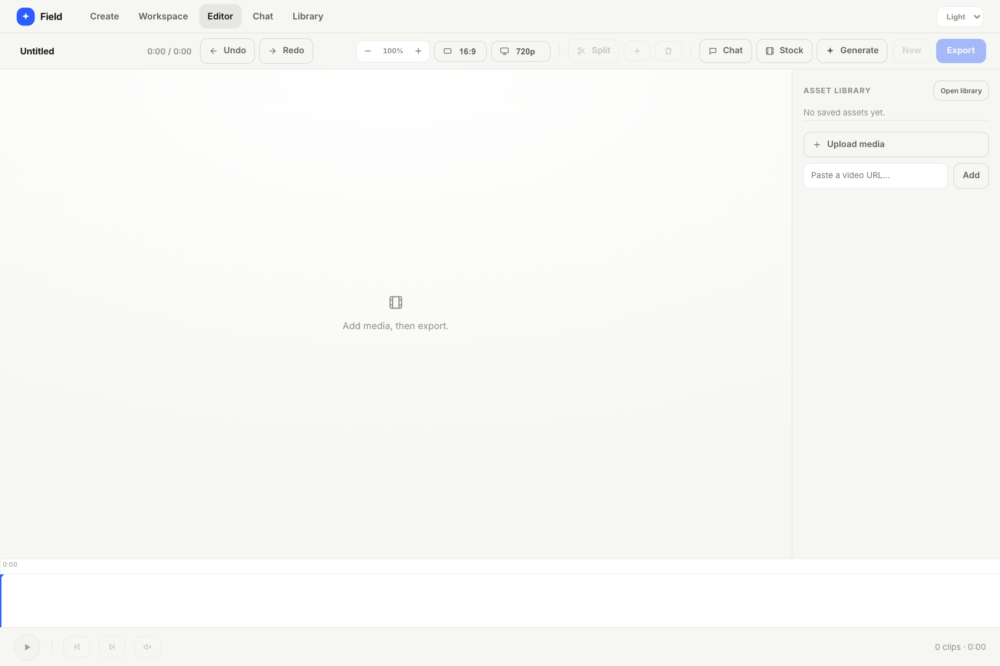
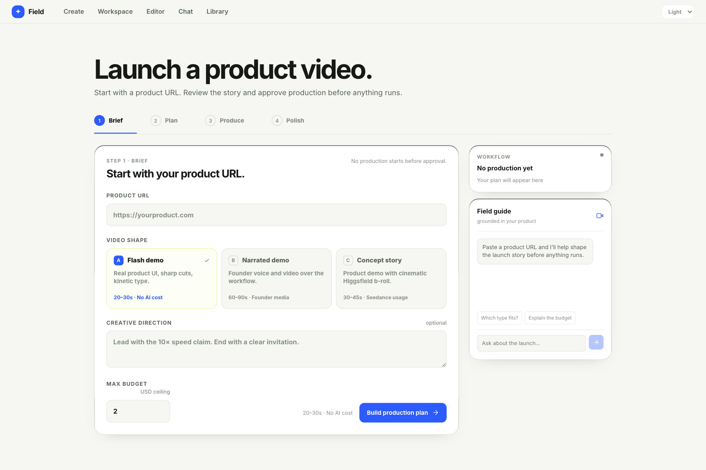

# Field — Recreate Higgsfield

A local-first creative studio for AI media generation, visual workflows, editing, and product-launch videos. Your projects and Launchframe media stay on your computer; this is a personal local app, not a shared hosting service.

## Screenshots

<p align="center">
  
  
</p>
<p align="center">
  
  
</p>
<p align="center">
  
</p>

## What you can do

- Generate images and videos with the available Higgsfield models.
- Connect compatible generators and tools in the visual Workspace, then send media to the Editor.
- Arrange image, video, and audio clips on a timeline and export an MP4.
- Turn a public product URL into a Launchframe plan, review it, approve production, and assemble the result locally.
- Search Pexels for stock footage when a Pexels API key is configured.

Audio and 3D generation screens are included, but live API availability depends on the Higgsfield endpoints and permissions available to your account. The app reports provider errors when an endpoint is unavailable; without credentials, generation uses clearly marked demo/catalog results instead of claiming a live render.

## Requirements

- Node.js 22.9 or newer
- npm
- `ffmpeg` on `PATH` for Launchframe video assembly (`brew install ffmpeg` on macOS; install an ffmpeg package on Linux or Windows)

## Quick start

```sh
git clone https://github.com/artificialguybr/recreate-higgsfield.git
cd recreate-higgsfield
npm ci
cp .env.example .env
npm run build
npm start
```

Open **http://127.0.0.1:3000**. You can skip the `.env` copy and run without provider keys; demo/catalog mode remains available.

For frontend development, keep the backend running with `npm start` in one terminal and run `npm run dev` in another. Open the Vite URL it prints (default: **http://localhost:5174**). If you change `PORT`, use the same value for both processes.

## API keys and settings

Put provider credentials in the local `.env` file. Never prefix secrets with `VITE_` and never commit `.env`.

| Variable | Required | Purpose |
| --- | --- | --- |
| `HF_API_KEY_ID` | For live Higgsfield generation | Higgsfield API key ID |
| `HF_API_KEY_SECRET` | For live Higgsfield generation | Higgsfield API secret |
| `PEXELS_API_KEY` | Optional | Pexels stock-footage search |
| `PORT` | Optional | Local server port; defaults to `3000` |
| `HOST` | Optional | Bind address; defaults to `127.0.0.1` |
| `FIELD_DATA_DIR` | Optional | Private directory for Launchframe workflows, uploads, and exports |

The server binds to loopback by default because its local API proxies use your provider keys. Do not set `HOST=0.0.0.0` or expose the port to a network.

## Data and exports

Launchframe data is stored outside the repository under `~/.recreate-higgsfield/launchframe-data` (or the equivalent directory in your OS home folder). Set `FIELD_DATA_DIR` to move it. An empty new data directory is populated from the legacy repository-level `launchframe-data/` directory on first run; the old copy is not deleted automatically.

Launchframe assembly requires the system `ffmpeg` executable. The Editor's browser-based export loads the ffmpeg WebAssembly core from jsDelivr the first time it is used, so that export needs an internet connection.

## License

No license file is included yet. Ask the repository owner before reusing or redistributing this project.
